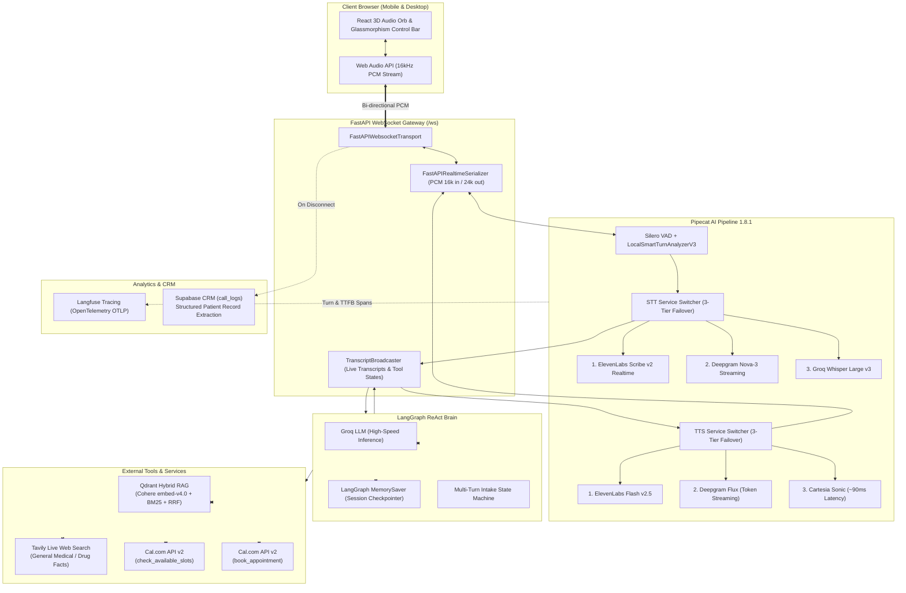

# 🏥 Apex Medical AI — Real-Time Voice Assistant & Clinical RAG

A production-grade, ultra-low latency real-time conversational AI voice assistant engineered for hospital front-desk reception, clinical triage, knowledge retrieval, automated appointment scheduling, and post-call CRM logging.

Built on **Pipecat AI 1.8.1**, **FastAPI WebSockets**, **LangGraph ReAct Agent**, **Groq LLaMA Inference**, **Qdrant Hybrid Vector RAG (Cohere Dense + BM25 Sparse)**, **Cal.com API v2**, **Supabase CRM**, **Langfuse Observability**, and a modern **React 3D Audio-Reactive WebGL Orb Frontend**.

---

## 🏗️ System Architecture



---

## ⚡ Key Capabilities & Features

### 1. 🎙️ Ultra-Low Latency Voice Pipeline (Pipecat AI 1.8.1)
- **Natural Barge-In / Interruption**: Powered by **Silero VAD** with `LocalSmartTurnAnalyzerV3` to immediately silence the bot when the user starts speaking.
- **Bi-directional Raw PCM**: 16kHz 16-bit mono PCM input with 24kHz studio-quality playback output streamed over WebSockets without heavy WebRTC gateway overhead.
- **Clean Audio Framing**: Uses `TTSSpeakFrame` for instant welcome greetings without sentence-aggregator buffering delays.

### 2. 🔄 Dual 3-Tier Service Failover Switchers
Zero-downtime reliability with automatic fallback cascading:
- **Speech-to-Text (STT) Failover**:
  1. Primary: **ElevenLabs Realtime STT** (`scribe_v2_realtime` with VAD commit strategy)
  2. Secondary: **Deepgram STT** (`nova-3` with real-time interim transcriptions)
  3. Tertiary: **Groq Whisper** (`whisper-large-v3-turbo`)
- **Text-to-Speech (TTS) Failover**:
  1. Primary: **ElevenLabs TTS** (`eleven_flash_v2_5` — ultra-realistic human cadence)
  2. Secondary: **Deepgram Flux** (`flux-brittany-en` with token-by-token aggregation)
  3. Tertiary: **Cartesia TTS** (`sonic-latest` — ~90ms ultra-fast fallback)

### 3. 🧠 Hybrid Dense + Sparse RAG Engine (Qdrant + Cohere)
- **Dense Embeddings**: **Cohere `embed-v4.0`** (1536 dimensions) for deep semantic comprehension.
- **Sparse BM25 Search**: **`Qdrant/bm25`** for exact keyword matching (form IDs, doctor names, room policies).
- **Reciprocal Rank Fusion (RRF)**: Combines dense and sparse results using Qdrant's native `FusionQuery(fusion=models.Fusion.RRF)` for maximum accuracy.
- **Hospital Knowledge Base (`data/guide.pdf`)**: Comprehensive 10-page front-desk reference guide covering:
  - Clinic and outpatient schedules & 24/7 Ground Floor Pharmacy
  - Patient intake forms (`Form G-101`, `H-202`, `P-303`, `F-404`)
  - Specialist referral rules (Cardiology, Neurology, Oncology) vs direct booking
  - 15-minute late arrival grace period, standby queue, and cancellation fees
  - Accepted insurance plans (BlueCross, Aetna, Cigna, Medicare, Medicaid, Humana) & 0% interest payment plans
  - Diagnostic test prep (fasting glucose, abdominal/pelvic ultrasound, MRI, CT contrast)
  - Ward visiting hours, ICU restrictions, and noon checkout policies
  - Free 24/7 medical interpretation in 40+ languages and accessibility accommodations

### 4. 📅 Automated Cal.com Appointment Booking (State Machine)
An explicit 5-turn conversational intake state machine collects patient details step-by-step:
1. **Turn 1 (Offer Slots)**: Queries live open slots via Cal.com API v2.
2. **Turn 2 (Collect Name & Email)**: Captures patient contact information.
3. **Turn 3 (Insurance & Phone)**: Captures health plan provider and phone number in a single clean prompt.
4. **Turn 4 (Chief Complaint / Reason)**: Cross-checks conversation history for symptoms mentioned earlier or prompts for visit reason.
5. **Turn 5 (Book & Confirm)**: Creates booking on Cal.com, inserts custom patient notes, and triggers instant email confirmation.

### 5. 🌐 Live Clinical Web Search (Tavily AI)
- Calls `web_search` for open-ended medical queries, general disease overviews, home remedies, drug interactions, and precautions.
- Provides concise 1–2 sentence guidance and conditionally asks if the patient wants to schedule a doctor consultation only when personal symptoms are described.

### 6. 📊 Automated Post-Call CRM Logging (Supabase)
Upon call termination, an asynchronous background task parses the conversation transcript using Groq into structured clinical JSON and persists it directly into Supabase (`call_logs`):
- Patient Name, Email, & Mobile Phone
- Insurance Provider & Chief Complaint
- Scheduled Appointment Time & Booking Status (`Booked` vs `Inquiry Only`)
- Clinical Summary & Call Outcome Category

### 7. 📡 Full Observability & Tracing (Langfuse + OpenTelemetry)
- Integrated via `opentelemetry-exporter-otlp-proto-http` to stream OTLP telemetry directly to **Langfuse Cloud**.
- Captures turn-by-turn spans: STT transcriptions, LLM prompts/completions with token counts, tool execution latency, and TTS Time-To-First-Byte (TTFB).

### 8. 🎨 Modern Glassmorphism 3D Orb UI (React + Three.js)
- **3D Audio-Reactive Orb**: Custom WebGL shader orb that physically responds to incoming/outgoing microphone volume levels and agent states (*Listening, Thinking, Speaking, Idle*).
- **Responsive Mobile Overlay**: Full-screen slide-up conversation transcript drawer with clean header controls and text chat input that never compresses the voice orb.
- **Glassmorphism Control Dock**: Floating pill with enclosed VU meter wave animation, mute toggle, transcript trigger, and call action button.
- **Dynamic Color Themes**: 4 clinical themes (*Sky Blue, Warm Sand, Silver Gray, Cyber Cyan*).

---

## 📁 Project Directory Structure

```text
├── data/
│   └── guide.pdf                  # 10-page comprehensive hospital knowledge guide
├── frontend/                      # React + Vite + TailwindCSS frontend
│   ├── src/
│   │   ├── components/
│   │   │   ├── agents-ui/         # AgentControlBar & AgentChatTranscript
│   │   │   └── ui/                # 3D WebGL Orb, BackgroundWave, ShimmeringText
│   │   ├── hooks/
│   │   │   └── useVoiceAgent.js   # WebSocket binary PCM audio stream & Web Audio hook
│   │   ├── App.jsx                # Main application layout & state coordinator
│   │   ├── index.css              # Design tokens and tailwind utilities
│   │   └── main.jsx
│   ├── package.json
│   └── vite.config.js
├── qdrant_db/                     # Persistent local Qdrant vector database
├── scripts/
│   └── gen_info.py                # ReportLab generator for the 10-page hospital guide PDF
├── src/
│   ├── bot.py                     # Core Pipecat pipeline, ReAct agent, failovers, WS serializer
│   ├── cal.py                     # Cal.com API v2 client (slots checking & booking)
│   ├── config.py                  # Pydantic environment configuration & settings
│   ├── db.py                      # Groq structured transcription extraction & Supabase logger
│   └── rag_engine.py              # Qdrant Hybrid search (Cohere embed-v4.0 + BM25 + RRF)
├── main.py                        # FastAPI application entrypoint & static asset server
├── pyproject.toml                 # UV / Python dependency definitions
└── .env                           # Environment variables & API credentials
```

---

## ⚙️ Environment Variables Reference (`.env`)

Create a `.env` file in the project root:

```env
# ── Groq LLM & Speech Inference ──
GROQ_API_KEY=gsk_...
GROQ_MODEL=openai/gpt-oss-120b
GROQ_STT_MODEL=whisper-large-v3-turbo
LLM_TEMPERATURE=0.0

# ── ElevenLabs (STT & Primary TTS) ──
ELEVENLABS_API_KEY=sk_...
ELEVENLABS_VOICE_ID=cgSgspJ2msm6clMCkdW9
ELEVENLABS_MODEL_ID=eleven_flash_v2_5

# ── Deepgram (Secondary STT & Secondary TTS) ──
DEEPGRAM_API_KEY=...
DEEPGRAM_STT_MODEL=nova-3
DEEPGRAM_VOICE=flux-brittany-en

# ── Cartesia (Tertiary TTS Fallback) ──
CARTESIA_API_KEY=sk_car_...
CARTESIA_VOICE_ID=e07c00bc-4134-4eae-9ea4-1a55fb45746b
CARTESIA_MODEL_ID=sonic-latest

# ── Cal.com Appointment Scheduling ──
CALCOM_API_KEY=cal_live_...
CALCOM_EVENT_TYPE_ID=6863049

# ── Cohere (Dense RAG Embeddings) ──
COHERE_API_KEY=...

# ── Tavily (Live Web Search) ──
TAVILY_API_KEY=tvly-...

# ── Supabase (Patient CRM Database) ──
SUPABASE_URL=https://<your-project>.supabase.co
SUPABASE_KEY=eyJ...

# ── Langfuse Observability (OpenTelemetry) ──
ENABLE_TRACING=true
OTEL_EXPORTER_OTLP_ENDPOINT=https://cloud.langfuse.com/api/public/otel
OTEL_EXPORTER_OTLP_HEADERS=Authorization=Basic <base64_encoded_keys>,x-langfuse-ingestion-version=4

# ── Server ──
HOST=127.0.0.1
PORT=8000
```

---

## 🚀 Getting Started

### 1. Prerequisites
- **Python 3.13+** (managed via [`uv`](https://github.com/astral-sh/uv) recommended)
- **Node.js 18+** & **npm**

### 2. Backend Setup
```bash
# Clone the repository
git clone https://github.com/Bharath8080/Apex_Medical_AI_Voice_Assist.git
cd Apex_Medical_AI_Voice_Assist

# Install Python dependencies
uv sync

# Generate the 10-page Knowledge Base PDF
uv run python scripts/gen_info.py

# Launch the FastAPI WebSocket Server
uv run python main.py
```

### 3. Frontend Setup
```bash
cd frontend

# Install dependencies
npm install

# Run local development server
npm run dev
```

Open **`http://127.0.0.1:5173`** for local frontend development, or navigate to **`http://127.0.0.1:8000`** to access the production build served directly by FastAPI.

---

## 🧪 Verified Voice Interaction Scenarios

| Category | Example Voice Prompt | Expected Behavior |
| :--- | :--- | :--- |
| **Hospital KB (Hours)** | *"What are the visiting hours for the General Ward?"* | Invokes `rag_search` ➔ states 10 AM–1 PM & 4–8 PM, max 2 visitors. |
| **Hospital KB (Pharmacy)** | *"Is your pharmacy open 24 hours?"* | Invokes `rag_search` ➔ confirms Ground Floor 24/7 availability with bedside delivery. |
| **Hospital KB (Test Prep)** | *"How should I prepare for a fasting blood test?"* | Invokes `rag_search` ➔ specifies 10–12h water-only fast, no coffee/juice/gum. |
| **Hospital KB (Referral)** | *"Do I need a referral to see a cardiologist?"* | Invokes `rag_search` ➔ clarifies that cardiology requires written primary care referral. |
| **Web Search (Symptoms)** | *"I have had a bad migraine and sensitivity to light for two days. What should I do?"* | Invokes `web_search` ➔ provides concise relief guidance + offers doctor booking. |
| **Appointment Booking** | *"Yes, please schedule an appointment."* | Enters Cal.com state machine: offers live slots ➔ collects name/email ➔ collects insurance/phone ➔ confirms. |
| **Chit-Chat / Presence** | *"Are you still active?"* | Acknowledges naturally without re-reading the welcome script (*"Yes, I am here! How can I help you?"*). |

---

## 🗄️ Supabase CRM Schema (`call_logs`)

To setup your call logging database in Supabase, execute the following SQL:

```sql
CREATE TABLE IF NOT EXISTS public.call_logs (
    id BIGINT GENERATED BY DEFAULT AS IDENTITY PRIMARY KEY,
    created_at TIMESTAMPTZ DEFAULT NOW(),
    patient_name TEXT DEFAULT 'Unknown',
    patient_email TEXT DEFAULT '',
    patient_phone TEXT DEFAULT '',
    insurance_provider TEXT DEFAULT '',
    chief_complaint TEXT DEFAULT '',
    appointment_time TEXT DEFAULT '',
    booking_status TEXT DEFAULT 'Inquiry Only',
    call_summary TEXT DEFAULT '',
    call_outcome TEXT DEFAULT '',
    raw_transcript TEXT DEFAULT ''
);
```

---

## 📄 License
This project is licensed under the MIT License.
